# Hi, I'm Ashutosh Dubey 👋

<picture>
  <source media="(prefers-color-scheme: dark)" srcset="./dark.svg">
  <source media="(prefers-color-scheme: light)" srcset="./light.svg">
  
</picture>

  <b>Java Full Stack Developer · Web Developer · Backend Developer · Software Builder</b>

  ☕ Java / Spring Boot &nbsp;·&nbsp; ⚛️ React &nbsp;·&nbsp; 🌐 JavaScript
  &nbsp;·&nbsp; 🗄️ MySQL &nbsp;·&nbsp; 🔗 REST APIs &nbsp;·&nbsp; 🛠️ Git / GitHub

I build **full-stack web applications, management systems, REST APIs, responsive interfaces, and practical software solutions**.

My current engineering interests sit at the intersection of **Java backend development, Spring Boot, React, database-driven applications, REST APIs, modern web development, and software engineering**.

---

## 🚀 What I Build

- ☕ **Java / Spring Boot applications** — REST APIs, backend services and database-driven systems
- ⚛️ **React applications** — responsive interfaces, dashboards and modern web experiences
- 🌐 **Full-stack applications** — connecting frontend interfaces with backend APIs and databases
- 🗄️ **Database systems** — MySQL and application data workflows
- 🔗 **REST APIs** — building and integrating APIs for real-world applications
- 📊 **Management systems** — ERP, task management, CRM and business-oriented applications
- 🎨 **Responsive web experiences** — clean interfaces focused on usability
- 🚀 **Deployment & development workflows** — Git, GitHub, Vercel, Netlify and modern tooling

---

## 💼 Experience

### Java Full Stack Developer Trainee — TalentNext / Wipro

**Jul 2025 – Oct 2025**

Completed hands-on Java Full Stack development training with a focus on:

- Core Java and object-oriented programming
- Spring Boot and REST API development
- Database integration and SQL
- Full-stack application development
- Software development workflows and practical projects

### Java Full Stack Developer — EduSkills Virtual Internship

**Jul 2025 – Sep 2025**

Worked on a **Student Management System** with CRUD functionality.

- Built frontend interfaces using **HTML, CSS and JavaScript**
- Developed backend functionality using **Java and Spring Boot**
- Integrated **MySQL**
- Implemented CRUD application workflows
- Practiced complete application development from frontend to database

### Web Developer Intern — Internshala

Worked on practical web development tasks and strengthened frontend development skills through hands-on project work.

---

## 🧩 Featured Projects

### 🎓 College ERP Management System

[Live Application](https://college-erp-management-system-ashu.vercel.app)

A web-based college management application focused on bringing academic and administrative workflows into a centralized digital experience.

- Management-oriented web application
- Dashboard-focused interface
- Responsive user experience
- Practical college management workflows
- **Web Development · JavaScript · Responsive UI**

### 🎯 TaskGenZ — Task Management Platform

[Live Application](https://task-gen-z.vercel.app/dashboard)

A productivity-focused task management application with a modern dashboard experience.

- Task management workflows
- Interactive dashboard
- Productivity-focused interface
- Responsive application design
- **React · TypeScript · Tailwind CSS**

### ☕ BrainBrew Cafe

[Live Website](https://brainbrewcafe.netlify.app)

A modern café website designed to create a welcoming digital presence for students, faculty and visitors.

- Responsive website
- Modern UI
- Café-focused user experience
- Mobile-friendly design
- **HTML · CSS · JavaScript**

### 🏢 Guru Kripa — Business / CRM System

A business-oriented application focused on customer communication, enquiries and operational workflows.

- Customer communication
- Enquiry management
- Business workflows
- REST API architecture
- Database integration
- **Java · Spring Boot · MySQL · React**

### 🌐 AshuPortfolio

My personal developer portfolio showcasing projects, skills and my development journey.

- Personal branding
- Project showcase
- Responsive design
- Developer-focused UI
- **HTML · CSS · JavaScript**

---

## 🛠️ Engineering Stack

### ☕ Languages

`Java` `JavaScript` `HTML5` `CSS3` `SQL`

### ⚛️ Frontend

`React` `JavaScript` `TypeScript` `Tailwind CSS` `Bootstrap` `Responsive Design`

### ⚙️ Backend

`Java` `Spring Boot` `REST APIs` `Node.js`

### 🗄️ Databases

`MySQL` `MongoDB` `PostgreSQL` `H2`

### 🧰 Development Tools

`Git` `GitHub` `VS Code` `Postman` `Maven` `NetBeans`

### ☁️ Deployment

`Vercel` `Netlify` `Firebase`

### 🧠 Engineering Interests

`Full-Stack Development` `REST API Architecture` `Database Design` `Object-Oriented Programming` `DSA` `Software Engineering`

---

## 🧠 Currently Learning

I'm continuously improving my engineering skills in:

- ☕ Advanced **Java**
- ⚙️ **Spring Boot & REST API architecture**
- ⚛️ **React & modern frontend development**
- 🗄️ **Database design & SQL**
- 🧩 **Data Structures & Algorithms**
- 🏗️ **Backend architecture**
- 🚀 **Deployment & production workflows**

---

## 📊 GitHub Activity

  

<h2 align="center">Contribution Activity</h2>

  <picture>
    <source
      media="(prefers-color-scheme: dark)"
      srcset="https://raw.githubusercontent.com/ashudubeyvns/github-snake/output/github-snake-dark.svg"
    />
    <source
      media="(prefers-color-scheme: light)"
      srcset="https://raw.githubusercontent.com/ashudubeyvns/github-snake/output/github-snake.svg"
    />
    
  </picture>

---

## 📫 Connect With Me

  💻 <a href="https://github.com/ashudubeyvns">GitHub</a> 
  💼 <a href="https://www.linkedin.com/in/ashutoshdubey0908/">LinkedIn</a> 
  🎓 <a href="https://college-erp-management-system-ashu.vercel.app">College ERP — Live</a> 
  🎯 <a href="https://task-gen-z.vercel.app/dashboard">TaskGenZ — Live</a> 
  ☕ <a href="https://brainbrewcafe.netlify.app">BrainBrew Cafe — Live</a>

> **Build things. Learn continuously. Solve real problems. 🚀**
